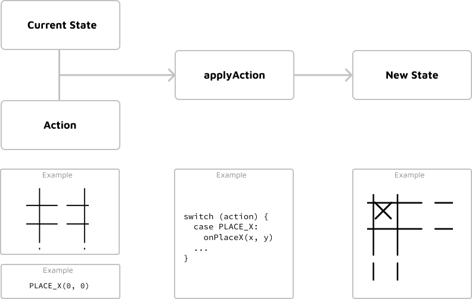
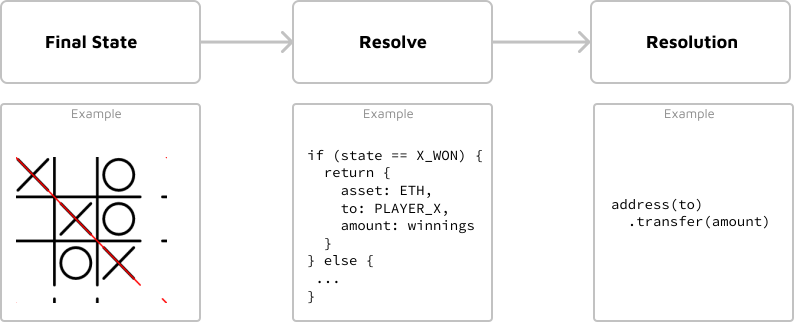

# Architecture.md

Application-specific code is isolated in a stateless contract. Examples of these contracts can be seen in the repository `cf-apps`.

The framework code lives in more places. We know that in case of a dispute, individual counterfactually instantiated contracts must be put on chain and their storage modified throughout the dispute. This storage must contain:

- application-specific state such as the state of a chess board, as well as
- other state not specific to the application, such as the state nonce and how long a dispute has been going on for

The layout of this storage is defined in `StateChannel.sol`. The application-specific state is stored through the `StateChannel.state.appStateHash` storage field. This is a hash of the application-specific state (aka “app state”), whose data structure is defined by the dapp developer (e.g. see `PaymentApp::AppState`). When the current app state needs to actually be read, it must be passed in as an argument, and the framework code ensures that the hash matches; this way, the app state is only ever stored in calldata/stack/memory, never storage, saving gas.

Upon conclusion of a dispute, apps return a struct called `Transfer.Details`, which specifies what happens to the state deposit assigned to the app. For state deposits which are ether and ERC20 tokens, the framework ensures that the returned transfer details transfer less tokens than a precomitted `Transfer.Terms`, allowing us to limit the impact of bugs in application code.

## App Interface

App functionality is defined in a stateless contract. This function defines the data structure used for app state, typically a struct named `AppState`, as well as app logic through non-state-modifying functions. By non-state-modifying we mean that they cannot use the `SSTORE` instruction; this corresponds to the solidity function modifiers `pure` or `view`. To enforce this restriction, these functions are called through the `staticcall` opcode.

Up to four functions can be implemented. The signatures are as follows:

- `isStateTerminal: AppState → bool`
- `getTurnTaker: AppState → uint256`
- `applyAction: (AppState, Action) → AppState`
- `resolve: AppState → Transfer.Details`

In designing the framework we must try to achieve two sometimes contradictory goals. One the one hand, we wish to allow app developers to view application state as a structured data type, the same way the developer of a non-channelized dapp would interact with contract storage. On the other hand, the framework would like to treat application state as a blob of unstructured data. Current limitations around the Solidity type system sometimes put these in conflict; for instance, we enforce the limitation that the `AppState` struct must not be dynamically sized. In the future, improvements such as abi.decode will allow us to remove these and other restrictions and move to a cleaner API.

Another limitation is that the return type of `resolve` is actually `bytes`. We expect that application developers simply end their `resolve` function with something like

`return abi.encode(nextState);`

where `nextState` has type `AppState`.

### `applyAction` and `getTurnTaker`: The Application State Transition Function

If `AppState` defines the data structure needed to represent the state of an app instance, `applyAction` defines the app logic that operates on the app. In a Tic-Tac-Toe game, `AppState` represents the state of the board, and `applyAction` and `getTurnTaker` together implement the logic of Tic-Tac-Toe. The return value of `getTurnTaker` corresponds to an address who can unilaterally update the app state. This update is done through the `applyAction` function; the caller also specifies the type of update (e.g. placing an X at a certain place on the board) by passing in additional data of type `struct Action` (this struct is also defined by the app developer).



### resolve

From certain app states, `resolve` can be called to return a value of type `struct Transfer.Details` (this is defined by framework code in `Transfer.sol`). This allows the state deposit assigned to the app to be reassigned, for e.g., to the winner of the Tic-Tac-Toe game.



### isStateTerminal

Some app states are marked terminal. An app state `a` is terminal if there does not exist an action `c` such that `applyAction(a, c)` returns without throwing. In other words, the app state transition graph has no outgoing edges from `a`. Since we cannot statically check this property, the app developer can manually mark these states by making `isStateTerminal` return true for them, allowing us to skip one step of dispute resolution.

Note that this is an optimization; this function can always safely be omitted, at the cost that sometimes disputes would take longer than strictly necessary.

## Framework State

An app exists in three main states or “statuses”, namely `ON`, `OFF` and `DISPUTE`. The `ON` state represents the state where a dispute has not started, while the `OFF` state represents one where a dispute has finished (typically through moving to a terminal app state).

```
enum Status {
  ON,
  DISPUTE,
  OFF
}

struct State {
  Status status;
  bytes32 appStateHash;
  uint256 nonce;
  uint256 finalizesAt;
  ...
}
```

In addition, an app in a DISPUTE state has a `finalizesAt` field representing the block height before which a responding `progressDispute` call must be made. Hence, the functions in `StateChannel.sol` distinguish between four logical states: `ON`, `DISPUTE`, `DISPUTE-TIMED-OUT` and `OFF`.

The first two logical statuses (`ON`, `DISPUTE`) are also called “channel on”, and the other two (`DISPUTE-TIMED-OUT`, `OFF`) are called “channel off”.


### `appStateHash` and `nonce`

As discussed above, `appStateHash` is a hash of the app state. The nonce field represents which signed `appStateHash`es are more recent.

## Framework State Transition Function

The framework state transition function is defined by the functions

- `setState`
- `createDispute`
- `progressDispute`
- `cancelDispute`
- `setResolution`

These functions contain docstrings docummenting their purpose and what states they start from (`DISPUTE`, open, etc).

# `StateChannel.sol`: Implementation Details

## Storage

```
Auth public auth;
State public state;
Transfer.Details public resolution;
bytes32 private appHash;
bytes32 private termsHash;
uint256 private defaultTimeout;
```

- three fields `auth`, `appHash` and `termsHash` are set by the constructor and never modified (only read); they parameterize the contract.
- the `resolution` field is set at the end of a dispute.
- the `state` field is modified throughout the dispute.

### auth

`auth` specifies the set of parties “interested in” the object:

```
struct Auth {
  address owner;
  address[] signingKeys;
}
```

the `setState` operation require unanimous consent from the set of interested parties; this means that the corresponding function can be called if either

- `msg.sender` is `auth.owner`, or
- a hash of the arguments is signed with `auth.signingKeys`

### appHash

The `appHash` is the hash of a `struct App`

```
struct App {
  address addr;
  bytes4 applyAction;
  bytes4 resolve;
  bytes4 getTurnTaker;
  bytes4 isStateTerminal;
}
```

This specifies the four functions that define an app by specifying the contract address and, for each function, the function signature.

### resolution

An instance of the struct `Transfer.Details`

```
struct Details {
  uint8 assetType;
  address token;
  address[] to;
  uint256[] amount;
  bytes data;
}
```

This struct represents a locked blockchain state ("state deposit") such as eth, erc20, or any other arbitrary right. `assetType` describes common classes such as eth. State deposits that do not fit into a predefined type will be represented by an `OTHER` type which specifies an address and a message call to the address.

When a dispute is resolved, this storage field is set to an instance of `Transfer.Details`, which specifies what happens the state deposit assigned to the app (e.g., given to the winner).

### termsHash

This is the hash of the struct `Transfer.Term`. When an app is installed, a term is precommitted to; for eth and erc20 asset types, a term specifies a bound on the resolution details that may be returned from an app. This way, if an app contains bugs (and assuming the framework code does not), the loss of funds from the bug is limited.

# Commitments, Conditional Transfers and the Multisig

The multisig stores the state deposit of a state channel. To assign state deposit from the multisig to particular application instances, we use a conditional transfer contract to enable the multisig to make complex commitments. These commitments specify a `Transfer.Term` as described above.


## Multisig

This code makes use of a custom multisig defined in `MinimumViableMultisig.sol`. In the future, we believe all multisig wallets should be channel-compatible. We are working with teams from [Gnosis](https://github.com/gnosis/safe-contracts) and [dapphub](https://github.com/dapphub/ds-group) on wallet compatibility.
